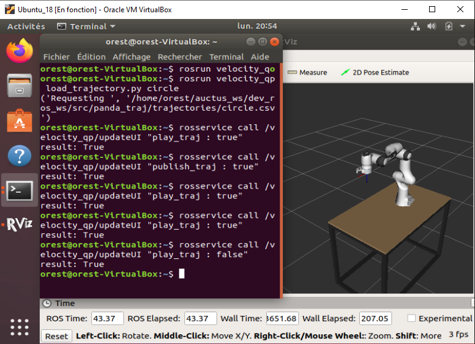
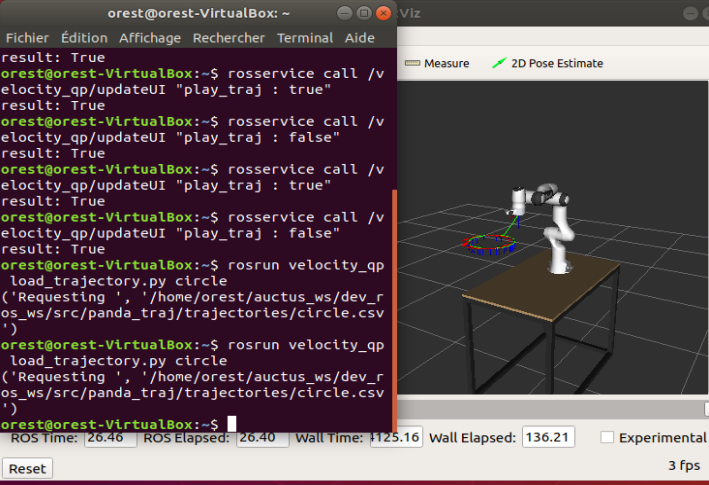

# AUCTUS_Result_simulation
### Une petite mise au point
Après avoir suivi le protocole entier décrit ici: [Auctus_Velocity](https://gitlab.inria.fr/auctus/panda/velocity_qp) , il était relativement simple de simuler le programme correctement. Cependant il est tout de même necessaire de rappeler que malgrès le fait que le protocole soit relativement simple, il faut prendre en considération l'environnement de mise ne oeuvre de la simulation. 
Pour un environnement comme celui de **UBUNTU 20** qui prend en considration ROS Noetic, il est impératif de prendre conscience du fait que celui-ci (UBUNTU) est installé avec python3 et non python 2. Pour le cas de **UBUNTU 18**, une fois la mise oeuvre effectuer, il ne reste qu'à modifier le fichier loa_trajectory.py en changeant le langage d'exécution du code de python3 vers python car celui-ci(UBUNTU) est installé avec python 2. 
### Quelques Résultats
Afin de visualiser le robot sur RVIZ, il a juste fallu appliquer la commande:  `roslaunch velocity_qp run.launch sim:=true`  dans un terminal.      
Puis dans un nouveau terminal, entrer la commande `rosrun velocity_qp load_trajectory.py circle` afin lire le fichier définissant la trajectoire circulaire à suivre par le robot comme décrit et affiché sur RVIZ.       
Il suffira dès lors de lancer le service `rosservice call /velocity_qp/updateUI "play_traj : true` afin de débuter la simulation.   
